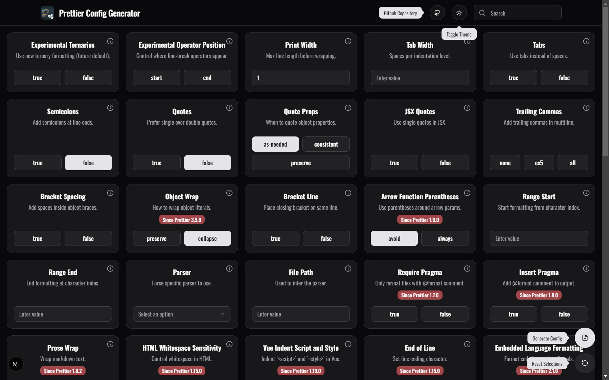
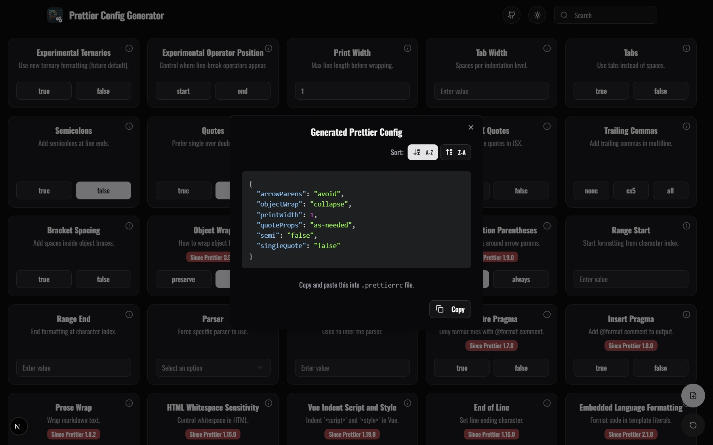

# 🎨 Prettier Config Generator

### _A modern, user-friendly web application that helps developers easily create and customize their `.prettierrc` configuration files._

**Built with Next.js 15, TypeScript, and Tailwind CSS**

---

## ✨ Features

<table>
<tr>
<td width="50%">

🚀 **Interactive Configuration**

> Real-time configuration generation as you select options

🎨 **Modern UI**

> Beautiful, responsive interface with dark/light theme support

🔍 **Search & Filter**

> Find specific options quickly with built-in search

</td>
<td width="50%">

📋 **Copy & Export**

> Easily copy generated configurations to your clipboard

🛡️ **Type-Safe**

> Full TypeScript support with type-safe option handling

📱 **Mobile Responsive**

> Works seamlessly on all device sizes

</td>
</tr>
</table>

## 🧑‍💻 Tech Stack

## 📸 Screenshots

### 🎯 Option Selection Interface

_Interactive interface for selecting and configuring Prettier options_

### � Configuration Export

_Generated configuration ready to copy and use in your project_

## 📄 License

This project is licensed under the MIT License - see the [LICENSE](LICENSE) file for details.

## 🙏 Acknowledgments

|                                   🎉 **Special Thanks**                                   |
| :---------------------------------------------------------------------------------------: |
| 🌟 [**mnicole**](https://github.com/mnicole/prettier-config) - _Original project creator_ |
|          💎 [**Prettier Team**](https://prettier.io/) - _Amazing code formatter_          |
|          🎨 [**shadcn/ui**](https://ui.shadcn.com/) - _Beautiful UI components_           |
|         🚀 [**Vercel**](https://vercel.com/) - _Next.js and deployment platform_          |

---

## 📬 Get in Touch

**Questions? Suggestions? We'd love to hear from you!**

### ⭐ **Found this helpful? Give us a star!**

_Your support helps us improve and maintain this project_ 💖

