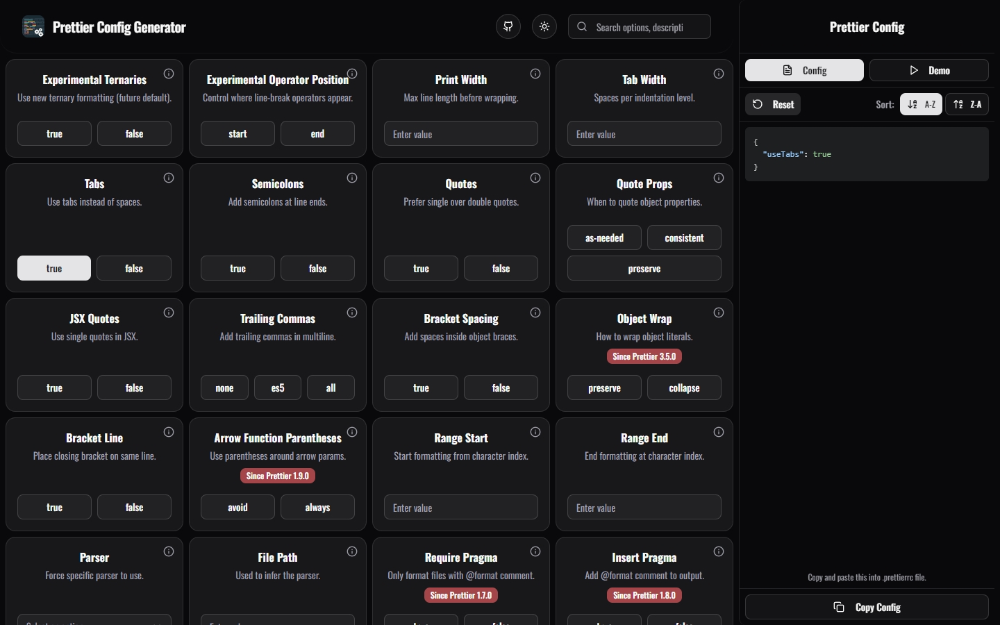
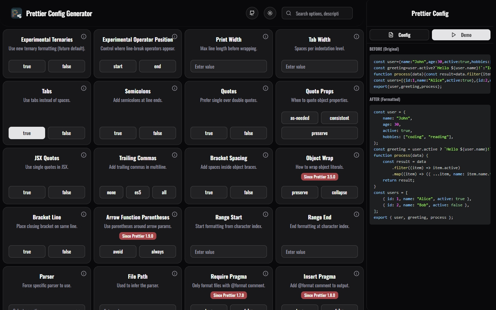

# 🎨 Prettier Config Generator

### _A modern, user-friendly web application that helps developers easily create and customize their `.prettierrc` configuration files._

**Built with Next.js 15, TypeScript, and Tailwind CSS**

---

## 🧑‍💻 Tech Stack

## ✨ Features

### 🚀 **Interactive**

- **Real-time Generation**: Configuration updates as you select options
- **Multiple Input Types**: Support for buttons, selects, inputs, and multi-select options
- **Modern UI**: Beautiful, responsive interface with dark/light theme support
- **Tooltips**: Comprehensive help system with detailed explanations for each option
- **Information Dialogs**: Extended documentation and examples for complex settings
- **Syntax Highlighting**: Beautiful JSON config display with dark theme support
- **Search Integration**: Find options by name, description, or related terms
- **Toast Notifications**: Instant feedback for user actions with beautiful notifications
- **Sample Code**: Live demonstration with before/after code comparison
- **Aside Dashboard**: Dedicated config panel on large screens for enhanced workflow

### 📐 **Configuration Management**

- **Smart Copy & Export**: One-click copy to clipboard with toast notifications
- **Configuration Sorting**: Sort config keys alphabetically (A-Z or Z-A) for better organization
- **Copy Functionality**: One-click clipboard copying with success notifications
- **Format Validation**: Server-side formatting ensures accurate Prettier output

## 📸 Screenshots

### 🎯 Option Selection Interface

_Interactive interface for selecting and configuring Prettier options_

### 🧑‍💻 Code formatting demo

_Generated Code formatting live demo_

## 📄 License

This project is licensed under the MIT License - see the [LICENSE](LICENSE) file for details.

## 🙏 Acknowledgments

|                                            🎉 **Special Thanks**                                            |
| :---------------------------------------------------------------------------------------------------------: |
| 🌟 [**mnicole**](https://github.com/mnicole/prettier-config) - _Original project that this was forked from_ |
|                   💎 [**Prettier Team**](https://prettier.io/) - _Amazing code formatter_                   |
|                   🎨 [**shadcn/ui**](https://ui.shadcn.com/) - _Beautiful UI components_                    |
|                  🚀 [**Vercel**](https://vercel.com/) - _Next.js and deployment platform_                   |

---

## 📬 Get in Touch

**Questions? Suggestions? We'd love to hear from you!**

### ⭐ **Found this helpful? Give us a star!**

_Your support helps us improve and maintain this project_ 💖

